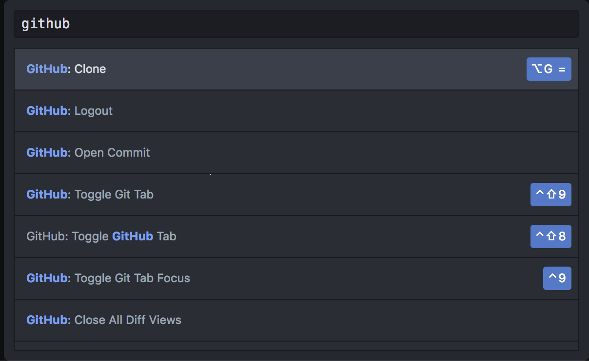

## Exercise Guide

_Legend_

Icon | Desription
 :---: | -------------
:warning:             | **Warning** If you misconfigure a step marked with this icon, later steps might not work properly. Check the step carefully before you move forward.
:exclamation:         | **Attention** Review this step or comment carefully to save time, learn a best practice, or avoid errors.
:information_source:  | **Information** A comment labeled with this icon provides information about the topic or procedure.
:book:                | **References** A comment labeled with this icon identifies reference material that provides additional information.

### Exercise 1: Importing an existing repository from GitHub into Atom

#### Objectives
This exercise focuses on enabling you to do the following:
- Create a repository in GitHub repositories
- Importing an existing repository into your new repositories.
- Update and add files and commit the changes to GitHub.

**Task 1: Create repository in GitHub and import existing repository**

Step | Action
---- | -------------
1-1  | Create a new repository on GitHub.com (e.g. atomsample). You don’t have to initialise the repository with a README because you are importing an existing repository.
1-2  | Once your repository is created, scroll down to ‘import code’ and paste the url of this sample repository: https://github.com/macmurph42/atomsample.git . This may take a couple of minutes.
1-2  | In the Atom Editor type Shift-Command-P (Shift-Ctrl-P on Windows) to toggle the Atom Command Palette   
1-3  | Type Github:Clone and paste the url from step 2.  (Your new repository) This will also create a new folder in your GitHub home directory on your disk (e.g. /Users/florianmeyer/github/atomsample)
1-4  | At some point, you may be asked to enter a GitHub token. You can create this token on https://github.atom.io/auth/github_package/token

**Task2: Create new files and update your repository**

Step | Action
---- | -------------
2-1  | Create a new file in your project. You create that file in Finder/File Explorer natively or you can create that file in the Atom Editor.
2-2  | When you create a new file or update an existing one, it will listed in the ‘Git’ Tab in Atom as ‘Unstaged Change’.
2-3 | Go to the ‘Git’ Tab in Atom and click on ‘Stage all’. The file that you just added is now listed in ‘Staged Changes’. Type some text in the text field  and click "Commit to Master".
2-4 | Click ‘publish’ to push the changes to GitHub.  
